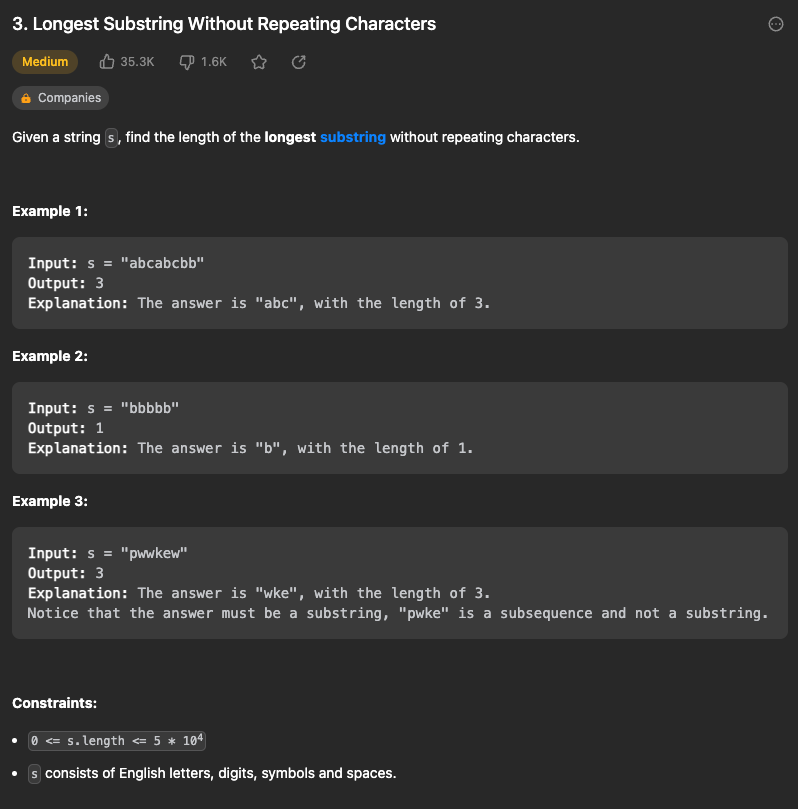
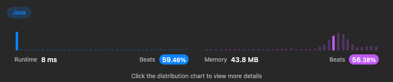

# 03. Longest Substring Without Repeating Characters

- [03. Longest Substring Without Repeating Characters](https://leetcode.com/problems/longest-substring-without-repeating-characters/)

### Check List

- 중복 문자를 제거하고 끊어지면 더 이상 부분 문자열이 아닌 점에 유의해야 한다.

### Result

