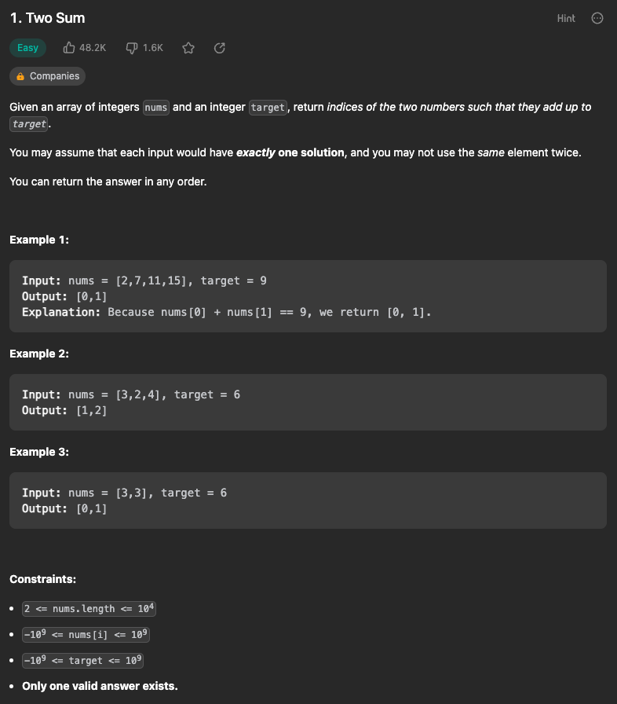

# Two Sum

## 01. Two Sum

### Check List
- valid 답 1개
  - -> 정답이 무조건 있다고 해서, for문 안에서 함수가 종료될 것으로 보고 마지막 return을 임의로 해줬는데, 해당 부분은 수정 필요할 듯.

### Result

- 단순 비교 (이중 for문 중복만 제외한)

- Map을 이용해 시간 복잡도 감소
